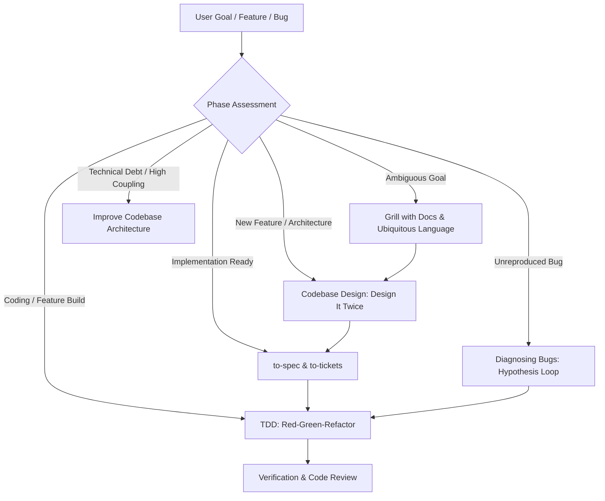
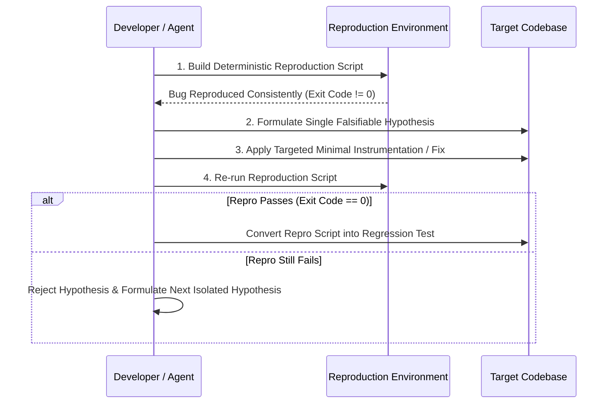

# Universal Engineering & AI Architecture Skill Suite

---

## 1. Overview & Core Philosophy

The `engineering` skill is the canonical standard for writing production-grade, testable, and maintainable software with coding agents. It prevents "vibe coding" failure modes by enforcing rigorous engineering disciplines:
1. **Never guess**: Establish a ubiquitous domain language (`CONTEXT.md`) and document hard architectural trade-offs (`ADR.md`).
2. **Design it twice**: Compare shallow vs deep interfaces before committing to implementation.
3. **Red-Green-Refactor**: Always create a failing test reproducing the bug or confirming the feature contract before writing production code.
4. **Isolate hypotheses**: Formulate explicit falsifiable hypotheses during debugging rather than making shotgun changes.



---

## 2. Master Phase Router (`ask-matt` Pattern)

When faced with any engineering task, the agent must identify the current lifecycle phase and adhere to its boundaries:

| Phase | Entry Trigger | Primary Artifacts | Exit Criteria |
| :--- | :--- | :--- | :--- |
| **1. Discovery & Alignment** | Broad idea, vague requirement, unclear terminology | `CONTEXT.md`, `ADR/000X-*.md` | Domain terms defined; architectural trade-offs signed off. |
| **2. Architectural Design** | Non-trivial module structure or cross-cutting concern | Interface prototypes, Design comparison | 2+ design options evaluated; deep interface selected. |
| **3. Spec & Breakdown** | User approved high-level approach | `SPEC.md`, Ticket checklist | Atomic, tracer-bullet tickets with explicit verification steps. |
| **4. Test-Driven Build** | Ready to implement ticket/feature | Failing unit/integration test, passing code | Minimal passing implementation, green suite, refactored clean code. |
| **5. Bug Diagnosis** | Broken behavior, failed tests, user reported defect | Repro script (`hitl-loop`), Hypothesis log | Deterministic reproduction; single verified root cause patch. |
| **6. Architecture Audit** | Code smells, circular imports, high blast radius | Architecture graph, Refactoring plan | Decoupled boundaries, verified contracts. |

---

## 3. Domain Modeling & Ubiquitous Language

Misalignment occurs when agents and engineers use different words for the same domain concept, or the same word for different concepts.

### 1. The `CONTEXT.md` Glossary
Maintain a persistent `CONTEXT.md` at the root or docs directory of the repository:
```markdown
# Domain Context & Glossary

## Ubiquitous Language
- **Lesson**: A discrete learning unit with video and exercise markdown.
- **Section**: An ordered grouping of lessons within a module.
- **Materialization**: The act of writing in-memory module state to the physical file system.
- **Materialization Cascade**: A sequential reconciliation where updating parent metadata triggers downstream path recalculations.
```

### 2. Architecture Decision Records (ADR)
When making non-obvious technical decisions, write an ADR inside `docs/adr/000X-title.md`:
```markdown
# ADR-0004: Event-Driven Materialization via Local SQLite Log

## Status
Accepted

## Context
When materializing course video structures, direct filesystem writes caused race conditions during parallel uploads.

## Decision
Introduce a local SQLite append-only journal. Materialization workers consume from the journal sequentially.

## Consequences
- **Positive**: Zero race conditions; deterministic undo/redo capability.
- **Negative**: Adds local SQLite schema dependency; minor overhead on small batch updates.
```

---

## 4. Codebase Design: The "Design It Twice" Engine

Before writing substantial logic, compare at least two architectural options:
- **Shallow Interface**: Exposes internal implementation details, leaks state, requires callers to orchestrate multi-step setups.
- **Deep Interface**: Simple, minimal public API surface that conceals substantial internal complexity behind clean abstractions.

```
┌───────────────────────────────────────────────────────────┐
│                    Shallow Interface                      │
│   ┌───────────────────────────────────────────────────┐   │
│   │ API: step1(), step2(), checkValid(), commit()     │   │
│   └───────────────────────────────────────────────────┘   │
│        ▲ Callers must orchestrate all complexity          │
└───────────────────────────────────────────────────────────┘

┌───────────────────────────────────────────────────────────┐
│                     Deep Interface                        │
│   ┌───────────────────────────────────────────────────┐   │
│   │ API: sync(target)                                 │   │
│   ├───────────────────────────────────────────────────┤   │
│   │ Internal: diffing, validation, rollback, locks    │   │
│   └───────────────────────────────────────────────────┘   │
│        ▲ Maximum information hiding and stability         │
└───────────────────────────────────────────────────────────┘
```

---

## 5. Test-Driven Development (TDD) Protocol

1. **Write the Failing Test First**:
   - Write a unit or integration test expressing the expected contract.
   - Run the test suite and verify the test fails for the *expected reason* (assertion failure, not syntax error).
2. **Write Minimal Passing Code**:
   - Implement the simplest possible logic that turns the test green.
   - Do not prematurely build speculative generalizations.
3. **Refactor Under Green**:
   - Clean up naming, extract duplicate logic, optimize data structures.
   - Keep tests passing throughout the refactor step.
4. **Mocking Rules**:
   - Only mock at external architectural boundaries (Network, Disk I/O, Third-party APIs).
   - Never mock internal implementation details or domain entities.

---

## 6. Hypothesis-Driven Bug Diagnosis

Never apply trial-and-error fixes. Follow the 4-stage diagnosis cycle:



### Reproduction Harness Template (`scripts/reproduce-issue.sh` / `.ps1`)
```bash
#!/usr/bin/env bash
set -e
echo "Running reproduction harness for Issue #42..."
# Setup sandbox state
npm run build
# Execute offending invocation
node dist/index.js --input invalid-fixture.json
```

---

## 7. Spec Decomposition & Ticket Management

Transform macro feature requirements into atomic, tracer-bullet tickets:
- **Tracer-Bullet Strategy**: Build a slim, end-to-end slice connecting UI to Database first before filling out wide edge cases.
- **Ticket Criteria**:
  - **Single Responsibility**: Touches 1-3 cohesive files.
  - **Explicit Acceptance Criteria**: Quantifiable checks (e.g. `p99 latency < 50ms`, `status code 201 Created`).
  - **Executable Verification**: Command line command or test file to run.

---

## 8. Architectural Modernization & Coupling Audit

When improving legacy code or reducing technical debt:
1. **Analyze Dependency Graphs**: Identify bidirectional dependencies and dependency cycles.
2. **Break Cycles with Inversion of Control**: Introduce interfaces/contracts in domain layers; implement them in infrastructure layers.
3. **Export Architecture Status**: Generate an HTML/SVG architecture summary documenting the verified modular boundaries.


