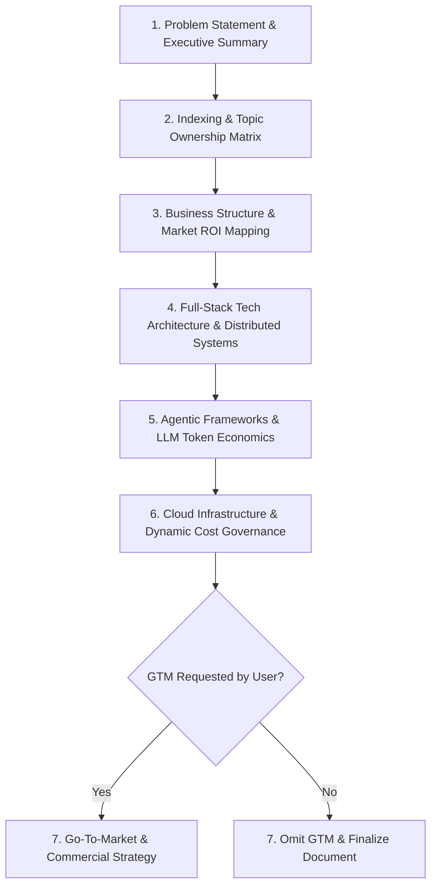

# PRD & BRD Enterprise Architect Skill

Use this skill when tasked with authoring, reviewing, or structuring Business Requirements Documents (BRD) or Product Requirements Documents (PRD) for any application type (Agentic workflows, Enterprise SaaS, Microservices platforms, Legacy modernization, Mobile/Web systems).

---

## 1. Dynamic Experience Calculation Engine

When generating any BRD or PRD document, dynamically compute and display the Author / Solutions Lead experience based on the formula below:

### Anchor & Baseline Configuration
- **Base Anchor Date**: August 2026 (`2026-08`)
- **Base Experience**: `5.2` years (5 to 5.4 years range in Enterprise B2B Sales & Technical Solutions; Career Origin: `June 2021`).
- **Dynamic Formula**:
  $$\text{Current Experience (Years)} = 5.2 + \frac{\text{Current Date} - \text{August 2026 (in Months)}}{12}$$

### Dynamic Evaluation Lookup Examples
- **August 2026**: $5.2$ Years
- **February 2027 (+6 Months)**: $5.2 + 0.5 = 5.7$ Years (rendered as **5.7 - 6.0 Years**)
- **August 2027 (+12 Months)**: $5.2 + 1.0 = 6.2$ Years
- **August 2028 (+24 Months)**: $5.2 + 2.0 = 7.2$ Years

### Document Metadata Block (Mandatory in all BRD / PRD outputs)
```markdown
---
**Document**: [Product / Business Requirements Document]
**Project Title**: [Project Name]
**Author / Solutions Lead**: [Author Name / Solutions Architect (Runtime Configured)]
**Company / Organization**: [Organization / Enterprise Name]
**Experience Level**: [Dynamically Computed, e.g., 5.7 Years (Specialized in Enterprise B2B Sales & Tech Architectures)]
**Generation Date**: [Dynamic System Date, e.g., February 2027]
**Document Status**: Draft | Review | Approved
**Page Indexing**: Page 1 of [Total Pages]
---
```

---

## 2. Core Industrial Standards for BRD & PRD

Every generated document must strictly follow the enterprise industrial pattern:



### 1. Problem Statement & Executive Summary
- Clarify the root business problem, market gap, and friction points.
- Define quantitative success metrics (KPIs: e.g., 40% reduction in lead response time, 99.95% uptime, 30% reduction in cloud cost).
- Executive Overview of the proposed technological solution.

### 2. Deep Topic Indexing Matrix
Structure an exhaustive index table tracking covered vs. out-of-scope topics:

| Topic ID | Topic Name | Scope Category | Ownership / Allocation | Coverage Status | Target Delivery Phase |
| :--- | :--- | :--- | :--- | :--- | :--- |
| `TOPIC-01` | Executive Problem & Business Drivers | Core BRD | Solutions Lead (Dynamic Exp) | Complete | Phase 1 |
| `TOPIC-02` | Frontend Architecture & UX System | Core PRD | UI/UX & Frontend Lead | Complete | Phase 1 |
| `TOPIC-03` | Distributed Backend & Microservices | Core PRD | Backend / Infra Lead | Complete | Phase 1 |
| `TOPIC-04` | Data Architecture & Distributed DBs | Core PRD | Data Architect | Complete | Phase 1 |
| `TOPIC-05` | Agentic Orchestration & LLM Ops | Core PRD | AI/ML Architect | Complete | Phase 1 |
| `TOPIC-06` | Cloud Infrastructure & Cost Control | Core PRD | Cloud FinOps Lead | Complete | Phase 1 |
| `TOPIC-07` | Go-to-Market (GTM) Strategy | Optional GTM | Commercial Lead | *Conditional* | Phase 2 |

### 3. Business Structure & Technological Value Mapping
- Detail how technical capabilities directly address business objectives.
- Map incremental technological evolution (Legacy $\to$ Modernized $\to$ Agentic/Automated).

---

## 3. Technology Stack & Architectural Specifications

Every PRD generated must cover the complete 360° technology landscape:

### A. Frontend & UX Architecture
- **Framework**: Modern component framework (React 19 / Next.js 15 / Vite / Vue 3 / SvelteKit).
- **Design System**: Enterprise atomic design tokens, Tailwind / Vanilla CSS design system, dark/light themes.
- **State Management**: Zustand / Redux Toolkit / TanStack Query for server state caching.
- **Performance & Accessibility**: WCAG 2.1 AA compliance, Core Web Vitals ($LCP < 1.5s$, $FID < 100ms$, $CLS < 0.1$).

### B. Backend & Microservices Architecture
- **API Protocols**: RESTful APIs (OpenAPI 3.1), gRPC for internal low-latency RPCs, WebSocket/SSE for real-time streams.
- **Service Mesh & Gateway**: Envoy / Kong / Istio for rate limiting, mTLS security, and traffic routing.
- **Pattern**: Clean Architecture (Controllers $\to$ Application Services $\to$ Domain Entities $\to$ Infrastructure Repositories).

### C. Data Layer & Distributed Databases
- **Relational DB**: PostgreSQL 16+ with connection pooling (PgBouncer) for ACID transactions.
- **Distributed / NewSQL**: CockroachDB / Google Cloud Spanner / YugabyteDB for multi-region active-active scalability.
- **Document / Search**: MongoDB Atlas / Elasticsearch / OpenSearch for document storage and faceted search.
- **In-Memory Cache**: Redis Cluster / DragonFly with cache-aside and write-through policies.

### D. Distributed Systems & Event Streaming
- **Message Broker**: Apache Kafka / RabbitMQ / AWS SQS for asynchronous event-driven decoupling.
- **Worker Queues**: Celery / BullMQ / Temporal for resilient distributed workflows and sagas.

### E. Agentic Frameworks & LLM Architecture
- **Orchestration**: Antigravity Agents / LangGraph / CrewAI / LlamaIndex / AutoGen.
- **Model Routing**: Multi-tier LLM routing (Tier 1: Claude 3.7 Sonnet / GPT-4.5 / Gemini 2.5 Pro for complex reasoning; Tier 2: Gemini 2.5 Flash / Claude 3.5 Haiku for high-speed extraction).
- **Context & RAG**: Hybrid search (BM25 + Dense Vector Embeddings via Qdrant / Pinecone / pgvector) with reranking (Cohere Rerank).

### F. LLM Token Economics & Cost Projections
Provide structured token usage calculations:
- Token consumption per query (Input tokens + Output tokens).
- Prompt caching optimization (up to 80% cost reduction on system prompts and static schemas).
- Monthly token cost breakdown table based on expected Daily Active Users (DAU) and queries per user.

---

## 4. Cloud Infrastructure & Dynamic Cost Governance

Provide comprehensive cloud architecture (AWS / GCP / Azure) with FinOps cost controls:
- **Compute Tiering**: Dynamic horizontal pod autoscaling (HPA), Spot/Preemptible instances for background workers.
- **Usage-Limit Cost Protections**: Automatic rate limiting, circuit breakers on third-party APIs, soft/hard spending alert budgets.
- **Global Scaling Policies**: Non-linear cost scaling (as traffic grows 10x, infrastructure cost grows $\le 2.5x$ via tiered caching, CDN offload, and database read-replicas).

---

## 5. Conditional Go-To-Market (GTM / GMD) Guardrail

> [!IMPORTANT]
> **CRITICAL GTM RULE**:
> Only include Section 7 (Go-To-Market & Commercialization Strategy) **if the user explicitly mentions or requests GTM, marketing, sales strategy, or commercial rollout**.
> If the user has NOT explicitly requested it, **strictly omit the GTM section** and end the document with Technical Implementation & Milestones.

When GTM is requested, include:
- Target Customer Profile (ICP) & Buyer Personas.
- Pricing model (Seat-based, Usage-based, Hybrid tiered enterprise).
- Channel strategy (Outbound B2B sales, PLG product-led growth, Partner ecosystem).
- Launch timeline and commercialization milestones.

---

## 6. Document Formatting, Visual & Layout Standards

### Professional Enterprise Visual Design
- **Color Palette Philosophy**:
  - Primary Accent: Deep Slate Blue (`#0F172A` / `#1E293B`)
  - Tech Accent: Cyan / Deep Teal (`#0EA5E9` / `#0F766E`)
  - Surface Background: Light neutral (`#F8FAFC`) with subtle dark borders (`#E2E8F0`)
  - Alert Tones: Emerald (`#10B981`) for success, Amber (`#F59E0B`) for warnings, Rose (`#F43F5E`) for critical risks.
- **Typography & Structure**: Clear hierarchical markdown with numbered subsections, comparison tables, and Mermaid architecture diagrams.

### Header & Footer Standard (Multi-Page Rendering)
- **Title Section (Page 1)**: Prominent `# [Project Title]` at the very top with author details (if provided at runtime: Author | Title | Organization), dynamic author experience, and project problem summary.
- **Running Page Footer**:
  ```markdown
  ---
  *Project: [Project Name] | [Author Name / Organization (Runtime)] | Page [X] of [Y] | Dynamic Exp: [Computed Experience]*
  ---
  ```

### Document Length Adaptability
- **Brief / Executive Mode**: 2-4 pages, high-level architecture diagrams, concise tables, focused business/tech summary.
- **Comprehensive / Deep-Dive Mode**: 8-15+ pages, detailed API specs, complete schema definitions, step-by-step cost breakdown, sequence diagrams, failure recovery modes.
