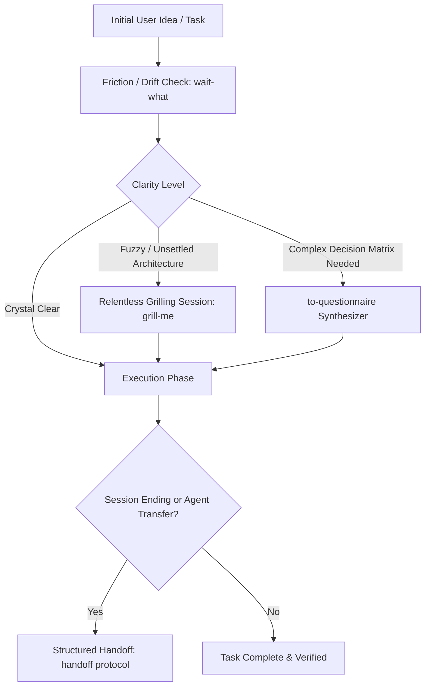

# Universal Productivity, Alignment & Grilling Skill Suite

---

## 1. Overview & Purpose

The single greatest source of wasted engineering time in AI-assisted development is **misalignment**—the agent builds what it thought the engineer wanted, only for the engineer to discard it.

The `productivity` skill eliminates communication gaps through:
1. **Relentless Socratic Grilling (`grill-me` / `grilling`)**: Interrogating the problem space before writing code.
2. **Deterministic Context Handoff (`handoff`)**: Serializing active state, decisions, and blocked paths between sessions.
3. **Structured Questionnaires (`to-questionnaire`)**: Converting fuzzy requirements into concrete multiple-choice matrices.
4. **Early Drift Interception (`wait-what`)**: Catching semantic misunderstandings before irreversible file modifications.
5. **Writing for Agents (`writing-for-agents`)**: Composing concise, unambiguous, action-oriented instructions.



---

## 2. The Relentless Grilling Engine (`grill-me` & `grilling`)

When a user initiates planning or uses trigger phrases like `/grill-me`, stress-test their ideas until reaching ironclad alignment.

### The Decision Frontier Protocol
1. Map the problem as a **design tree**: each root decision branches into dependent sub-decisions.
2. Group the tree into **rounds**. The **frontier** consists of questions whose prerequisites are already settled.
3. Present all questions on the active frontier in one round.
4. For every question, provide:
   - Clear title and contextual rationale.
   - Categorized multiple-choice options.
   - An explicit **Recommended Option** (`➡️ Recommended`).
5. Wait for the user's answers before generating the next round.

### Grilling Output Format
```markdown
❓ **Q1** - **State Persistence Layer**: Where should the session cache reside during local development?
   - [A] In-memory map (lost on server restart)
   - [B] SQLite database file in `.cache/session.db` (persisted, zero cloud dependencies)
   - [C] Redis container via Docker Compose

➡️ **(Recommended)**: [B] SQLite database file. It provides zero-install durability across server reloads without requiring Docker daemon overhead.

---

❓ **Q2** - **Authentication Handshake**: Which authentication strategy should be enforced for background webhooks?
   - [A] Shared bearer token header (`Authorization: Bearer <secret>`)
   - [B] HMAC-SHA256 signature verification over the request payload
   - [C] IP whitelist only

➡️ **(Recommended)**: [B] HMAC-SHA256 payload signing. It prevents replay attacks and does not leak credentials in transit logs.
```

---

## 3. Structured Context Handoff Protocol (`handoff`)

When ending a session, compact the current conversation state into a structured handoff document. This allows a fresh agent session or another engineer to pick up immediately with zero context loss.

### Handoff Document Template (`HANDOFF.md`)
```markdown
# Session Handoff Record

## 1. Executive Status
- **Goal**: Implement multi-tenant schema isolation for PostgreSQL.
- **Current State**: Phase 2 of 4 complete. Tenant migrations script drafted and tested.
- **Active Blockers**: None.

## 2. Settled Decisions & Invariants
- Enforced Row-Level Security (RLS) instead of separate schemas per tenant (see `docs/adr/0003-rls.md`).
- Tenant ID resolved via JWT claims in the API gateway middleware.

## 3. Touched & Verified Files
- `src/middleware/tenant.ts`: Extracts tenant UUID and executes `SET LOCAL app.current_tenant`.
- `tests/tenant-isolation.test.ts`: Integration tests passing (12/12 green).

## 4. Exact Next Actions
1. Apply tenant RLS policies to `billing_invoices` table in `migrations/004_invoices.sql`.
2. Run `npm test tests/tenant-isolation.test.ts`.
3. Validate query execution plan with `EXPLAIN ANALYZE`.
```

---

## 4. Ambiguity-to-Questionnaire Synthesizer (`to-questionnaire`)

When stakeholders provide high-level product notes, convert them into an exhaustive questionnaire:
- Categorize questions by domain: **Business Logic**, **Data Model**, **User Experience**, **Security/Compliance**.
- Prevent paralysis by providing sensible defaults for non-critical paths.

---

## 5. Early Drift Detection (`wait-what`)

Activate the `wait-what` checkpoint whenever:
- The user's prompt contradicts an invariant established in `CONTEXT.md` or an approved `ADR`.
- Tool outputs yield surprising side effects (e.g. schema migration deleted unexpected tables).
- The agent is about to execute destructive commands (`git reset --hard`, `DROP TABLE`, recursive deletion).

**Protocol**: Halt execution immediately. State the exact conflict in 2 sentences, display the divergent assumptions, and request confirmation before touching the filesystem.

---

## 6. Writing for AI Agents (`writing-for-agents`)

When authoring instructions, prompts, or skills for coding agents:
1. **Imperative, Active Voice**: Write "Run `npm test`" instead of "You should consider running npm test".
2. **Clear Scoping**: Specify forbidden actions (e.g. "Do not modify files outside `src/`").
3. **Structured Checklists**: Use markdown task lists `- [ ]` with unambiguous completion states.
4. **No Fluff**: Strip pleasantries, boilerplate, and excessive conversational preamble.


